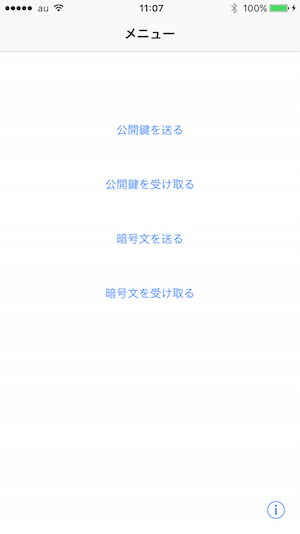

# BluetoothRSASample
iPhoneのBluetooth機能を使ってRSA暗号化を実感してみるサンプルです。2機の実機が必要です。

鍵の生成の為の実装は含まれていませんので、あらかじめ計算して求めたものを使ってください。

## スクリーンショット

## 使い方

### 1.鍵の登録
アプリ起動直後の画面の右下のインフォメーションアイコンから、設定画面を開く事が出来ます。プレースホルダーにサンプルの値が記入してありますので、その値を使う事ができます。

### 2.公開鍵の送信・受信
鍵を設定した側の端末から、もう一方の端末へ公開鍵に相当する値を更新します。

鍵を設定した端末は「公開鍵を送る」を、鍵を受け取る側の端末は「公開鍵を受け取る」を選択して下さい。「公開鍵を送る」内の画面では、Advertisingスイッチをオンにする事によって情報が発信されます。端末同士が一定距離内に近付くと、「公開鍵を受け取る」画面内で受け取った旨が表示されます。これで公開鍵情報が共有されました。

### 3.メッセージの送信
メッセージの送信は鍵を受け取った側の端末から行って下さい。メッセージの送信は、「暗号文を送る」から行う事が出来ます。入力されたメッセージを暗号化したものを送信します。

メッセージの受信は「暗号文を受け取る」から行う事が出来ます。メッセージの受信後、「復号化」ボタンを押す事によって、秘密鍵を使って暗号文の復号化を行います。
